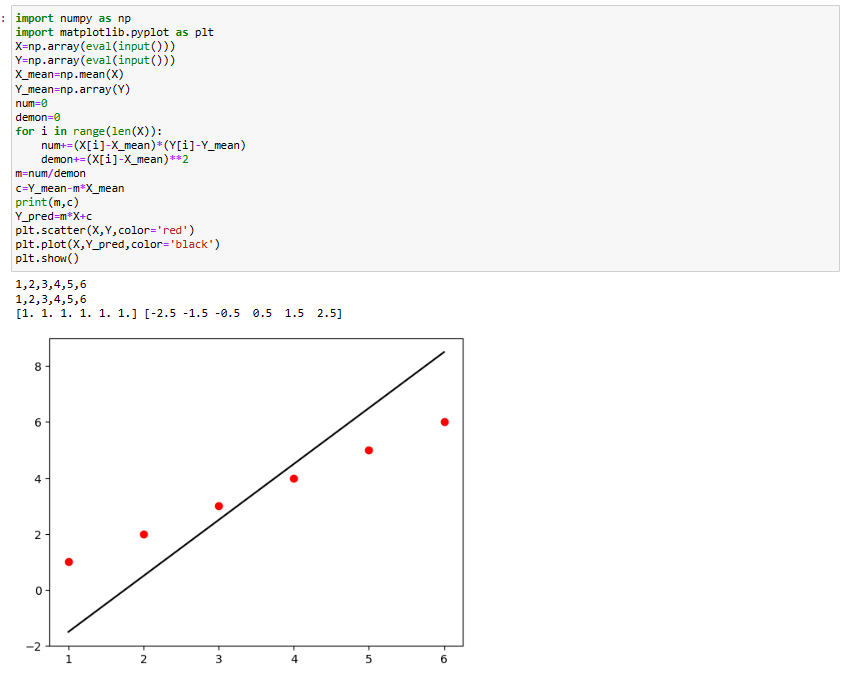

# Implementation of Univariate Linear Regression
## Aim:
To implement univariate Linear Regression to fit a straight line using least squares.
## Equipment’s required:
1.	Hardware – PCs
2.	Anaconda – Python 3.7 Installation / Moodle-Code Runner
## Algorithm:
1.	Get the independent variable X and dependent variable Y.
2.	Calculate the mean of the X -values and the mean of the Y -values.
3.	Find the slope m of the line of best fit using the formula.
 
4.	Compute the y -intercept of the line by using the formula:
  
5.	Use the slope m and the y -intercept to form the equation of the line.
6.	Obtain the straight line equation Y=mX+b and plot the scatterplot.
## Program
```python
# Implement of Multivariate linear regression and predict the output
# Developed By: vignesh R
# Reference number:23005542

import numpy as np
import matplotlib.pyplot as plt
X=np.array(eval(input()))
Y=np.array(eval(input()))
X_mean=np.mean(X)
Y_mean=np.array(Y)
num=0
demon=0
for i in range(len(X)):
    num+=(X[i]-X_mean)*(Y[i]-Y_mean)
    demon+=(X[i]-X_mean)**2
m=num/demon
c=Y_mean-m*X_mean
print(m,c)
Y_pred=m*X+c
plt.scatter(X,Y,color='red')
plt.plot(X,Y_pred,color='black')
plt.show()

```
## Output

## Result
Thus the univariate Linear Regression was implemented to fit a straight line using least squares.
